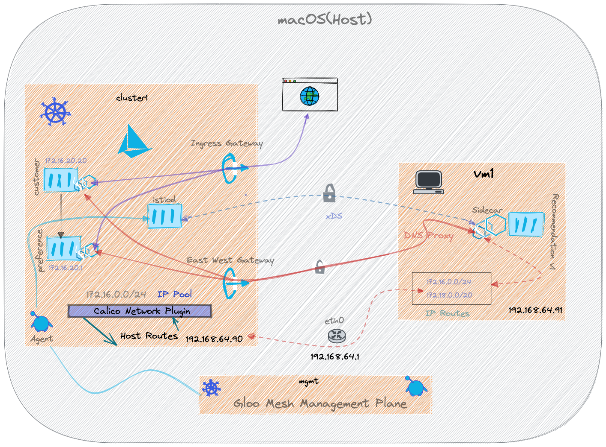

# Istio VM Demo

Work In Progress

## Tools

- Python3
- [direnv](https://direnv.net)
- [multipass](https://multipass.run/)
- [kubectl](https://kubernetes.io/docs/tasks/tools/)
- [calico](https://projectcalico.docs.tigera.io/)
- [jq](https://stedolan.github.io/jq/)

## Download Sources

```shell
  git clone https://github.com/kameshsampath/gloo-mesh-vm-demo
  cd gloo-mesh-vm-demo
```

## Demo Architecture



## Ensure Environment

```shell
direnv allow .
```

## Create Virtual Machines

```shell
make create-vms
```

## Kubernetes Cluster

### Settings

The k3s cluster will be a single node cluster run via multipass VM. We will configure that to with the following flags,

- `--cluster-cidr=172.16.0.0/24` allows us to create 65 – 110 Pods on this node
- `--service-cidr=172.18.0.0/20` allows us to create 4096 services
- `--disable=traefik` disable `traefik` deployment

For more information on how to calculate the number of pods and service per CIDR rang, check the [GKE doc](https://cloud.google.com/kubernetes-engine/docs/concepts/alias-ips).

### Create Kubernetes Cluster

The following command will create kubernetes(k3s) cluster and configure it with [Calico](https://projectcalico.docs.tigera.io) plugin.

```shell
make create-kubernetes-clusters
```

## Deploy Gloo Mesh

```shell
make deploy-gloo
```

## Deploy Istio

```shell
make deploy-istio
```

## Deploy Demo Applictions

Deploy the httpbin and a sleep pod,

```shell
kubectl label ns default istio.io/rev=1-11-5
kubectl apply -k $DEMO_HOME/apps
```

### Deploy Istio Sidecar Virtual Machine

Install some essential packages on the vms,

```shell
make deploy-base deploy-base
```

Deploy the workload,

```shell
make deploy-base deploy-workload
```

### Calling Services

#### From VM to Kubernetes

```shell
multipass exec vm1  -- curl -I httpbin.default.svc.cluster.local:8000/status/200
```

You should get response like,

```shell
HTTP/1.1 200 OK
server: envoy
date: Mon, 10 Jan 2022 07:19:24 GMT
content-type: text/html; charset=utf-8
access-control-allow-origin: *
access-control-allow-credentials: true
content-length: 0
x-envoy-upstream-service-time: 3
```

#### From Kubernetes to VM

```shell
export SLEEP_POD=$(kubectl --context=cluster1 get pods -lapp=sleep -oname)
kubectl exec $SLEEP_POD -- curl -s vm-demos-app.vm-demos.svc.cluster.local:8080
```

You should get response like,

```shell
recommendation v1 from 'vm1': 1
```

