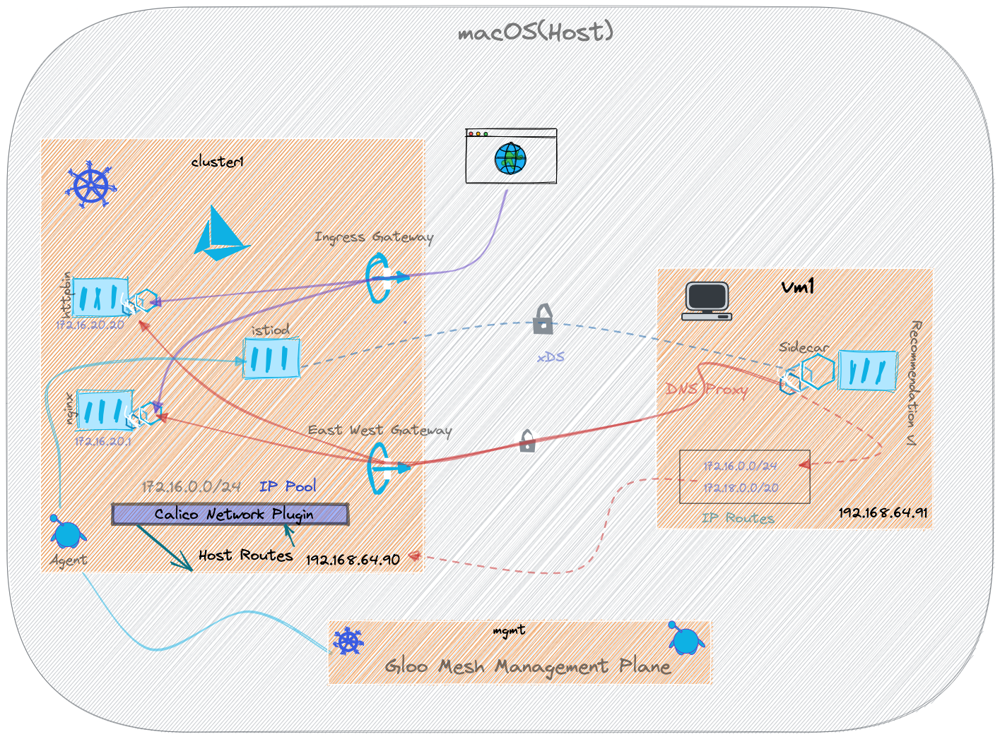

# Istio VM Demo

A simple microservices demo to show how to onboard VM workloads with Istio and make them work with Kubernetes services. The demo also shows how to use [Gloo Mesh](https://solo.io/products/gloo-mesh) to add features like Traffic Policy, Access Policy etc., that spans across Kubernetes and VM workloads.

Checkout the [HTML Documentation](https://kameshsampath.github.io/gloo-mesh-vm-demo/)
for detailed DIY guide.

## Tools

- Python3
- [direnv](https://direnv.net)
- [multipass](https://multipass.run/)
- [kubectl](https://kubernetes.io/docs/tasks/tools/)
- [calico](https://projectcalico.docs.tigera.io/)
- [jq](https://stedolan.github.io/jq/)

## Download Sources

```shell
git clone https://github.com/kameshsampath/gloo-mesh-vm-demo
cd gloo-mesh-vm-demo
```

## Demo Architecture



## Ensure Environment

```shell
direnv allow .
```

## Setup Ansible Environment

The demo will be using [Ansible](https://docs.ansible.com/){target=_blank} to setup the environment, run the following command to install Ansible modules and extra collections and roles the will be used by various tasks.

```shell
make setup-ansible
```

## Create Virtual Machines

```shell
make create-vms
```

## Kubernetes Cluster

### Settings

The k3s cluster will be a single node cluster run via multipass VM. We will configure that to with the following flags,

- `--cluster-cidr=172.16.0.0/24` allows us to create 65 – 110 Pods on this node
- `--service-cidr=172.18.0.0/20` allows us to create 4096 services
- `--disable=traefik` disable `traefik` deployment

For more information on how to calculate the number of pods and service per CIDR rang, check the [GKE doc](https://cloud.google.com/kubernetes-engine/docs/concepts/alias-ips).

### Create Kubernetes Cluster

The following command will create kubernetes(k3s) cluster and configure it with [Calico](https://projectcalico.docs.tigera.io) plugin.

```shell
make create-kubernetes-clusters
```

## Deploy Gloo Mesh

```shell
make deploy-gloo
```

## Deploy Istio

```shell
make deploy-istio
```

## Deploy Demo Applications

```shell
helm repo add istio-demo-apps https://github.com/kameshsampath/istio-demo-apps
helm repo update
```

```shell
kubectl label ns default istio.io/rev=1-11-5
```

Deploy Customer,

```shell
helm install --kube-context="$CLUSTER1" \
  customer istio-demo-apps/customer \
  --set enableIstioGateway="true"
```

Deploy Preference,

```shell
helm install --kube-context="$CLUSTER1" \
  customer istio-demo-apps/preference 
```

Call the service to test,

```bash
export INGRESS_GATEWAY_IP=$(kubectl --context ${CLUSTER1} -n istio-gateways get svc ingressgateway -o jsonpath='{.status.loadBalancer.ingress[0].*}')
export SVC_URL="${INGRESS_GATEWAY_IP}/customer"
```

```shell
curl $SVC_URL
```

The command should shown an output like,

```text
customer => preference => Service host 'http://recommendation:8080' not known.%
```

## Deploy Istio Sidecar Virtual Machine

Install some essential packages on the vms,

```shell
make deploy-base
```

Deploy the workload the `recommendation` service,

```shell
make deploy-workload
```

## Calling Services

### From VM to Kubernetes

```shell
multipass exec vm1 -- curl customer.default.svc.cluster.local:8080
```

The command should shown an output like,

```text
customer => preference => recommendation v1 from 'vm1': 1
```

### From Kubernetes to VM

```shell
curl $SVC_URL
```

The command should shown an output like,

```text
customer => preference => recommendation v1 from 'vm1': 2
```

## Cleanup

```shell
make clean-up
```
