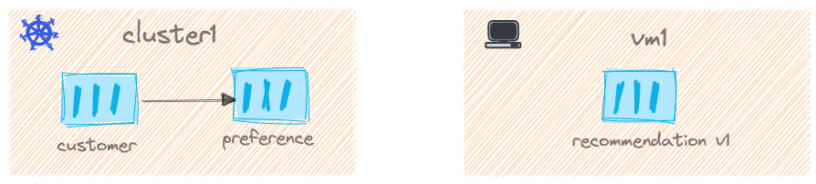

We now have the required environment Kubernetes, Gloo and Istio setup, as part of this chapter let us setup the services that will interact.

For this demo we will use three simple microservices namely `customer`, `preference` and `recommendation`; `customer` and `preference` services will be deployed on the Kubernetes `cluster1` and the `recommendation` will be on the `vm1`.


<figure markdown> 
  <figcaption>Demo Service Interactions</figcaption>
</figure>

All the applications used this demo are available as helm charts in my [GitHub repo](https://github.com/kameshsampath/istio-demo-apps), let us add that helm repo,

```shell
helm repo add istio-demo-apps https://github.com/kameshsampath/istio-demo-apps
helm repo update
```

Now doing a `helm search repo istio-demo-apps` should show the following apps,

```text
NAME                            CHART VERSION   APP VERSION     DESCRIPTION
istio-demo-apps/customer        0.1.0           1.0.0           A Helm chart to deploy customer demo application
istio-demo-apps/preference      0.1.0           1.0.0           A Helm chart to deploy Preference demo application
istio-demo-apps/recommendation  0.1.0           1.0.0           A Helm chart for A Helm chart to deploy recommendation demo application
```

Enable automatic sidecar injection on the `default` namespace,

```shell
kubectl label ns default istio.io/rev=1-11-5 --overwrite
```

!!! important
    Since we use revision based we use `istio.io/rev` label. If you have already labelled the namespace with `istio-injection=enabled` then remove it by,

    ```shell
    kubectl label ns default istio-injection-
    ```

Deploy `customer` service,

```shell
helm install --kube-context="$CLUSTER1" \
  customer istio-demo-apps/customer \
  --set enableIstioGateway="true"
```

## Resources

### Pods and Services

```shell
kubectl --context="$CLUSTER1" get svc,pods
```

```shell
NAME                 TYPE        CLUSTER-IP    EXTERNAL-IP   PORT(S)    AGE
service/kubernetes   ClusterIP   172.18.0.1    <none>        443/TCP    39h
service/customer     ClusterIP   172.18.7.18   <none>        8080/TCP   3m9s

NAME                            READY   STATUS    RESTARTS   AGE
pod/customer-59f5854d89-cm84k   2/2     Running   0          3m9s
```

### Gateway and Virtual Services

```shell
kubectl --context="$CLUSTER1" get gw,svc
```

```text
NAME                                           AGE
gateway.networking.istio.io/customer-gateway   4m57s

NAME                                                GATEWAYS               HOSTS   AGE
virtualservice.networking.istio.io/customer-v1-vs   ["customer-gateway"]   ["*"]   4m57s
```

---8<--- "includes/call-service.md"

The service calls will fail with error,

```text
customer => Service host 'http://preference:8080' not known.
```

Let us deploy `preference` service,

```shell
helm install --kube-context="$CLUSTER1" preference istio-demo-apps/preference
```

Now getting pods and services should show the following output,

```shell
kubectl --context="$CLUSTER1" get svc,pods
```

```shell
NAME                 TYPE        CLUSTER-IP    EXTERNAL-IP   PORT(S)    AGE
service/kubernetes   ClusterIP   172.18.0.1    <none>        443/TCP    39h
service/customer     ClusterIP   172.18.7.18   <none>        8080/TCP   30m
service/preference   ClusterIP   172.18.6.50   <none>        8080/TCP   73s

NAME                             READY   STATUS    RESTARTS   AGE
pod/customer-6bbb45d7db-5db6l    2/2     Running   0          11m
pod/preference-b95d64c99-9wjfp   2/2     Running   0          72s
```

Now calling the `customer` service again,

```shell
curl $SVC_URL
```

The command should shown an output like,

```text
customer => preference => Service host 'http://recommendation:8080' not known.%
```

Excellent! We not got our Kubernetes services ready. In next chapter lets deploy the `recommendation` service and make services to work together.

---8<--- "includes/abbrevations.md"
