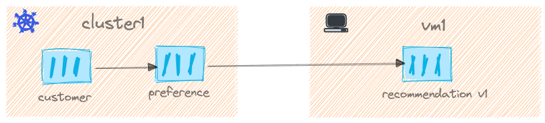

In the previous chapter we deployed the `customer` and `preference` service on to `cluster1` Kubernetes cluster. To complete our demo services interaction let us deploy `recommendation` on the VM.

As there are lot of moving parts[^1] in doing this setup, I packed them into set of [Ansible tasks](role_workload_vm.md). When you run the tasks of the playbook, it will do all that is required setup Istio Sidecar and `recommendation` namely,

- [x] Recommendation v1 service running in vm as daemon
- [x] Istio Sidecar installed and configured on the VM
- [x] IP Routes from VM to Kubernetes Service and Pods. Check [Istio VM Prerequisites](https://istio.io/v1.11/docs/setup/install/virtual-machine/#prerequisites) for more details.
- [x] Create a gateway so that the VM Istio Sidecar (Envoy) can communicate securely (mTLS) with **istiod** on `cluster1`.

At end of this chapter we should be able to make the service interaction flow work as shown below.


<figure markdown> 
  <figcaption>Demo Service Interactions</figcaption>
</figure>

Run the following command to prepare the VM with required packages,

```shell
make deploy-base
```

Then running the following command will make the VM ready with recommendation app with Istio Sidecar,

```shell
make deploy-workload
```

## Resources

### Pods and Services

```shell
kubectl --context="$CLUSTER1" get svc,pods
```

```shell
NAME                             READY   STATUS    RESTARTS   AGE
pod/customer-6bbb45d7db-5db6l    2/2     Running   0          56m
pod/preference-b95d64c99-9wjfp   2/2     Running   0          46m

NAME                     TYPE        CLUSTER-IP    EXTERNAL-IP   PORT(S)    AGE
service/kubernetes       ClusterIP   172.18.0.1    <none>        443/TCP    40h
service/customer         ClusterIP   172.18.7.18   <none>        8080/TCP   75m
service/preference       ClusterIP   172.18.6.50   <none>        8080/TCP   46m
{==service/recommendation   ClusterIP   172.18.6.63   <none>        8080/TCP   2m19s==}
```

### Workload Entry

A recommendation [Workload Entry](https://istio.io/latest/docs/reference/config/networking/workload-entry/){target=_blank},

```shell
kubectl --context="$CLUSTER1" workloadentries.networking.istio.io -owide
```

```yaml  hl_lines="8 10"
Name:         recommendation-vm1
Namespace:    default
Labels:       <none>
Annotations:  <none>
API Version:  networking.istio.io/v1beta1
Kind:         WorkloadEntry
Spec:
  Address:  192.168.64.92
  Labels:
    App:            recommendation
    instance_id:    vm1
    Version:        v1
  Network:          network1
  Service Account:  vm-service-account
Events:             <none>
```

As you noticed in the above output the output the address of the WorkloadEntry points to the `vm1` IP address. The recommendation service will use the selector labels from the WorkloadEntry i.e `App` to route the traffic to the `vm1` using the IP Address from WorkloadEntry.

!!! note
    You can get vm1 details using the command `multipass info vm1`

---8<--- "includes/call-service.md"

The customer service should now succeed completing the call to `recommendation` service on the `vm1`,

```text
customer => preference => recommendation v1 from 'vm1': 1
```

Voilà! We have now successfully connected all the services right from Kubernetes to VM.

The communication from vm to k8s should also work, lets do a quick test calling same customer service,

```shell
multipass exec vm1 -- curl customer.default.svc.cluster.local:8080
```

And you should get pretty much the same response,

```text
customer => preference => recommendation v1 from 'vm1': 2
```

In next chapter we will see how to apply various Service Mesh features like Rate Limit, Access Policies etc., using Gloo Mesh.

---8<--- "includes/abbreviations.md"

[^1]: https://istio.io/v1.11/docs/setup/install/virtual-machine
